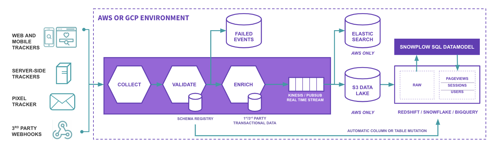

# Snowplow Golang Analytics SDK

[![Build Status][gh-actions-image]][gh-actions] [![Coveralls][coveralls-image]][coveralls] [![Go Report Card][goreport-image]][goreport] [![Release][release-image]][releases] [![License][license-image]][license]


Snowplow is a scalable open-source platform for rich, high quality, low-latency data collection. It is designed to collect high quality, complete behavioural data for enterprise business.

## Note
Due to issues in the release process, v0.2.2 should be used in favour of v0.2.0 or v0.2.1.

## Snowplow Pipeline Overview



The [Snowplow trackers][tracker-docs] enable highly customisable collection of raw, unopinionated event data. The pipeline validates these events against a JSONSchema - to guarantee a high quality dataset - and adds information via both standard and custom enrichments.

This data is then made available in-stream for real-time processing, and can also be loaded to blob storage and data warehouse for analysis.

The Snowplow atomic data acts as an immutable log of all the actions that occurred across your digital products. The [analytics SDKs][sdk-docs] are libraries in a range languages which facilitate working with Snowplow Enriched data, by transforming it from its original TSV format to a more amenable format for programmatic interaction - for example JSON.

## Quickstart

```bash
go get github.com/snowplow/snowplow-golang-analytics-sdk
```

<details> 
<summary>main.go</summary>

```go
package main

import (
    "fmt"

    "github.com/pkg/errors"

    "github.com/snowplow/snowplow-golang-analytics-sdk/analytics"
)

var (
    event      = `test-data1	pc	2019-05-10 14:40:37.436	2019-05-10 14:40:35.972	2019-05-10 14:40:35.551	unstruct	e9234345-f042-46ad-b1aa-424464066a33			py-0.8.2	ssc-0.15.0-googlepubsub	beam-enrich-0.2.0-common-0.36.0	user<built-in function input>	18.194.133.57				d26822f5-52cc-4292-8f77-14ef6b7a27e2																																									{"schema":"iglu:com.snowplowanalytics.snowplow/unstruct_event/jsonschema/1-0-0","data":{"schema":"iglu:com.snowplowanalytics.snowplow/add_to_cart/jsonschema/1-0-0","data":{"sku":"item41","quantity":2,"unitPrice":32.4,"currency":"RON"}}}																			python-requests/2.21.0																																										2019-05-10 14:40:35.000			{"schema":"iglu:com.snowplowanalytics.snowplow/contexts/jsonschema/1-0-1","data":[{"schema":"iglu:nl.basjes/yauaasd_context/jsonschema/1-0-0","data":{"deviceBrand":"Unknown","deviceName":"Unknown","operatingSystemName":"Unknown","agentVersionMajor":"2","layoutEngineVersionMajor":"??","deviceClass":"Unknown","agentNameVersionMajor":"python-requests 2","operatingSystemClass":"Unknown","layoutEngineName":"Unknown","agentName":"python-requests","agentVersion":"2.21.0","layoutEngineClass":"Unknown","agentNameVersion":"python-requests 2.21.0","operatingSystemVersion":"??","agentClass":"Special","layoutEngineVersion":"??"}},{"schema":"iglu:nl.basjes/yauaa_context/jsonschema/1-0-0","data":{"deviceBrand":"Unknown","deviceName":"Unknown","operatingSystemName":"Unknown","agentVersionMajor":"2","layoutEngineVersionMajor":"??","deviceClass":"Unknown","agentNameVersionMajor":"python-requests 2","operatingSystemClass":"Unknown","layoutEngineName":"Unknown","agentName":"python-requests","agentVersion":"2.21.0","layoutEngineClass":"Unknown","agentNameVersion":"python-requests 2.21.0","operatingSystemVersion":"??","agentClass":"Special","layoutEngineVersion":"??"}}, {"schema":"iglu:nl.basjes/yauaa_context/jsonschema/1-0-0","data":{"deviceBrand":"Unknown","deviceName":"Unknown","operatingSystemName":"Unknown","agentVersionMajor":"2","layoutEngineVersionMajor":"??","deviceClass":"Unknown","agentNameVersionMajor":"python-requests 2","operatingSystemClass":"Unknown","layoutEngineName":"Unknown","agentName":"python-requests","agentVersion":"2.21.0","layoutEngineClass":"Unknown","agentNameVersion":"python-requests 2.21.0","operatingSystemVersion":"??","agentClass":"Special","layoutEngineVersion":"??"}}]}		2019-05-10 14:40:35.972	com.snowplowanalytics.snowplow	add_to_cart	jsonschema	1-0-0		`
    valueToGet = `platform`
)

func main() {
    // parse the enriched event string
    parsedEvent, err := analytics.ParseEvent(event)
    if err != nil {
        fmt.Println(errors.Errorf(`error parsing event: %v`, err))
        return  
    }

    // Get specific value from event
    _, err = parsedEvent.GetValue(valueToGet)
    if err != nil {
        fmt.Println(errors.Errorf(`error getting value %s from event: %v`, valueToGet, err))
        return
    }
    
    // Get object in JSON format
    _, err = parsedEvent.ToJson()
    if err != nil {
        fmt.Println(errors.Errorf(`error converting parsed event to JSON: %v`, err))
        return
    }
    
    // Get object in map format
    _, err = parsedEvent.ToMap()
    if err != nil {
        fmt.Println(errors.Errorf(`error converting parsed event to map: %v`, err))
        return
    }
    
    // Get a JSON of values for a set of canonical fields
    _, err = parsedEvent.GetSubsetJson("page_url", "unstruct_event")
    if err != nil {
        fmt.Println(errors.Errorf(`error getting subset JSON: %v`, err))
        return
    }
    
    // Get a map of values for a set of canonical fields
    _, err = parsedEvent.GetSubsetMap("page_url", "domain_userid", "contexts", "derived_contexts")
    if err != nil {
        fmt.Println(errors.Errorf(`error getting subset map: %v`, err))
        return
    }
    
    // Get a value from all contexts using its path
    _, err = parsedEvent.GetContextValue(`fieldToRetrieve`, `subfieldToRetrieve`, 1) // context.fieldToRetrieve.subfieldToRetrieve[1]
    if err != nil {
        fmt.Println(errors.Errorf(`error getting context value: %v`, err))
        return
    }
    
    // Get a value from the unstruct_event field using its path
    _, err = parsedEvent.GetContextValue(`snowplow_add_to_cart_1`, `currency`, 0) // unstruct_event.snowplow_add_to_cart_1.currency[0]
    if err != nil {
        fmt.Println(errors.Errorf(`error getting unstruct_event value: %v`, err))
        return
    }
}
```
</details>

## API

```go
func ParseEvent(event string) (ParsedEvent, error)
```

ParseEvent takes a Snowplow Enriched event tsv string as input, and returns a 'ParsedEvent' typed slice of strings.
Methods may then be called on the resulting ParsedEvent type to transform the event, or a subset of the event to Map or Json.

```go
func (event ParsedEvent) ToJson() ([]byte, error)
```

ToJson transforms a valid Snowplow ParsedEvent to a JSON object.

```go
func (event ParsedEvent) ToMap() (map[string]interface{}, error)
```

ToMap transforms a valid Snowplow ParsedEvent to a Go map.

```go
func (event ParsedEvent) GetSubsetJson(fields ...string) ([]byte, error)
```

GetSubsetJson returns a JSON object containing a subset of the event, containing only the atomic fields provided, without processing the rest of the event.
For custom events and contexts, only "unstruct_event", "contexts", or "derived_contexts" may be provided, which will produce the entire data object for that field.
For contexts, the resultant map will contain all occurrences of all contexts within the provided field.

```go
func (event ParsedEvent) GetSubsetMap(fields ...string) (map[string]interface{}, error)
```

GetSubsetMap returns a map of a subset of the event, containing only the atomic fields provided, without processing the rest of the event.
For custom events and contexts, only "unstruct_event", "contexts", or "derived_contexts" may be provided, which will produce the entire data object for that field.
For contexts, the resultant map will contain all occurrences of all contexts within the provided field.

```go
func (event ParsedEvent) GetValue(field string) (interface{}, error)
```

GetValue returns the value for a provided atomic field, without processing the rest of the event.
For unstruct_event, it returns a map of only the data for the unstruct event.

```go
func (event ParsedEvent) ToJsonWithGeo() ([]byte, error)
```

ToJsonWithGeo adds the geo_location field, and transforms a valid Snowplow ParsedEvent to a JSON object.

```go
func (event ParsedEvent) ToMapWithGeo() (map[string]interface{}, error)
```

ToMapWithGeo adds the geo_location field, and transforms a valid Snowplow ParsedEvent to a Go map.

```go
func (event ParsedEvent) GetUnstructEventValue(path ...interface{}) (interface{}, error) {
```

GetUnstructEventValue gets a value from a parsed event's unstruct_event using it's path (`example1[0].example2`).

```go
func (event ParsedEvent) GetContextValue(contextName string, path ...interface{}) (interface{}, error) {
```

GetContextValue gets a value from a parsed event's contexts using it's path (`contexts_example_1.example[0]`)
## Copyright and license

Snowplow Golang Analytics SDK is copyright 2021 Snowplow Analytics Ltd.

Licensed under the **[Apache License, Version 2.0][license]** (the "License");
you may not use this software except in compliance with the License.

Unless required by applicable law or agreed to in writing, software
distributed under the License is distributed on an "AS IS" BASIS,
WITHOUT WARRANTIES OR CONDITIONS OF ANY KIND, either express or implied.
See the License for the specific language governing permissions and
limitations under the License.

[gh-actions-image]: https://github.com/snowplow/snowplow-golang-analytics-sdk/workflows/Test/badge.svg?branch=master
[gh-actions]: https://github.com/snowplow/snowplow-golang-analytics-sdk/actions

[coveralls-image]: https://coveralls.io/repos/github/snowplow/snowplow-golang-analytics-sdk/badge.svg?branch=master
[coveralls]: https://coveralls.io/github/snowplow-golang-analytics-sdk/snowplow?branch=master

[release-image]: https://img.shields.io/github/v/release/snowplow/snowplow-golang-analytics-sdk?include_prereleases
[releases]: https://img.shields.io/github/v/release/snowplow/snowplow-golang-analytics-sdk

[license-image]: http://img.shields.io/badge/license-Apache--2-blue.svg?style=flat
[license]: http://www.apache.org/licenses/LICENSE-2.0

[tracker-docs]: https://docs.snowplowanalytics.com/docs/collecting-data/collecting-from-own-applications/
[sdk-docs]: https://docs.snowplowanalytics.com/docs/modeling-your-data/analytics-sdk/

[goreport]: https://goreportcard.com/report/github.com/snowplow/snowplow-golang-analytics-sdk
[goreport-image]: https://goreportcard.com/badge/github.com/snowplow/snowplow-golang-analytics-sdk
